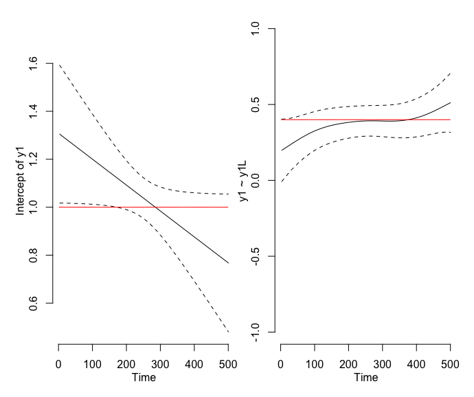
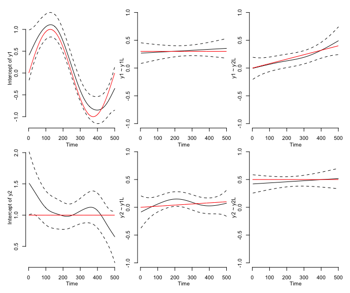
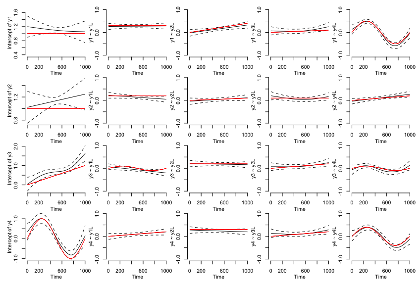
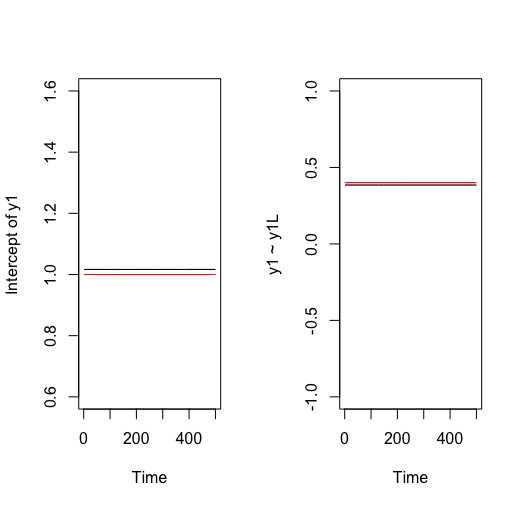

# tvvarGAM
tvvarGAM package as featured in [“A Tutorial on Estimating Time-Varying Vector
Autoregressive Models” (Haslbeck, Bringmann & Waldorp, 2020)](https://doi.org/10.1080/00273171.2020.1743630).

With this package one can estimate time-varying vector autoregressive models based on generalized additive models. It uses a regression form, making it easy to use. At the moment it can only handle gradual smooth change of both the intercept and the vector autoregressive parameters.

## tvvarSIM - Creating simulated data

```r
tvvarSIM <- function(
  nt,                        # number of time points
  nv,                        # number of variables
  FUN.aint = rep(1, nv),     # vector of length nv with 1s=invariant, 2s=linear, 3s=sine, setting type of intercept variance
  max.aint = rep(1, nv),     # vector of length nv with maximum values for the intercepts
  FUN.rho  = rep(1 , nv*nv), # matrix of shape (nv*nv) with 1s=invariant, 2s=linear, 3s=sine, setting type of relationship between variables and lagged variables 
  max.rho  = rep(.4, nv*nv), # matrix of shape (nv*nv) with maximum correlations between variables and lagged variables
  min.cor  = .1,             # minimum correlation value between variables
  max.cor  = .5              # maximum correlation value between variables
)

# Returns object of class tvvarSIM: list(y, aint, rho, sigma)
```

Caution: There are no checks implemented for the length/size of the inputs. Be sure they match the format given above.

### Univariate Model

```r
# Simulate data
set.seed(12345) # For the example
nt <- 500
nv <- 1
sim_data <- tvvarSIM(nt, nv)

# Fit model
object <- tvvarGAM(sim_data)

# Results
summary(object)
plot(object)
```



**What do we see here?**

In this most basic example we make an estimation for only one variable. In the image on the left you see that tvvarGAM estimated the intercept to decrease with time. The red line shows that the true intercept was in fact constant. 

On the right you see the estimation of the correlation over time between y1 and y1-lagged in black, and the true correlation in red.

Dotted lines show a confidence interval for the estimation.

The reason that both values are constant is that time-invariance is what the tvvarSIM defaults to. This shows that a model that assumes differences in a parameter over time is not accurate for time-invariant parameters.

### Bivariate Model

```r
# Simulate data
set.seed(12345) # For the example
nt <- 500
nv <- 2

simdata <- tvvarSIM(nt, nv,                    
  FUN.aint = c(3, 1),   # This vector specifies one sine intercept(y1) and one time-invariant intercept(y2)
  max.aint = c(1, 1),   # Max value of both intercepts set to 1
	
  FUN.rho  = c(1, 2,    # Relationship to own lagged version are each time-invariant, while the relationships to lagged version of different variables are both linear
	       2, 1),    # since there are 1s on the diagonal and 2s on the off-diagonal
	
  max.rho  = c(.3, .4,  # Different max values set for the correlations between the variables and the lagged variables.
	       .1, .5), # Autocorrelations on the diagonal, off-diagonal correlations are those between different variables.
	
  min.cor  = .1,        # Min correlation value between the variables 
  max.cor  = .5         # Max correlation value between the variables
)
```



**What do we see here?**

For multiple variables there is a supplementary plot for each relationship between any two of the variables (e.g. top-right, bottom-center)

As specified in the example, the relationships between the variables and their lagged selves is time-invariate, while the ones between the variables are linear.

Note, again, we see an inaccurate estimation for the intercept of y2, as it was specified to be time-invariant.

### Network Model

```r
# Simulate data
set.seed(12345)
nt <- 1000
nv <- 4

simdata <- tvvarSIM(nt, nv,                     
  FUN.aint = c(1, 1, 2, 3),                    
  max.aint = c(1, 1, 1, 1),                    
  FUN.rho  = c(1, 2, 2, 3,                                 
	       1, 2, 1, 2,                                 
	       3, 1, 2, 3,                                 
	       2, 1, 2, 3),                    
  max.rho  = c(.3, .4, .1, .5,                                 
	       .2, .1, .1, .2,                                 
	       .1, .2, .2, .1,                                 
	       .2, .3, .2, .4),                    
  min.cor  = .1,                    
  max.cor  = .5
)
```




### Estimation: Time-invariant vs. time-variant model for time-invariant data

In contrast to the first example, using a model that assumes time-invariance when there are time-invariant parameters will achieve much more accurate results.

```r
# Simulate data
set.seed(12345) # For the example
nt <- 500
nv <- 1
sim_data <- tvvarSIM(nt, nv)

# Fit model
laggedY <- lagmatrix(as.vector(sim_data$y),1)[,2]
gamObjY <- gam(sim_data$y ~ laggedY)

# Make coefficients into vectors for plotting
repY <- rep(gamObjY$coefficients[2], length(sim_data$y))
repInt <- rep(gamObjY$coefficients[1], length(sim_data$y))

# Plotting
par(mfrow = c(1, 2))
plot(1:y_length, repInt, xlab="Time", ylab="Intercept of y1", ylim=c(0.6,1.6), type="l")
lines(sim_data$aint, col="red")
plot(1:y_length, repY, xlab="Time", ylab="y1 ~ y1L", ylim=c(-1,1), type="l")
lines(sim_data$rho, col="red")
```

<figure>
	
</figure>
